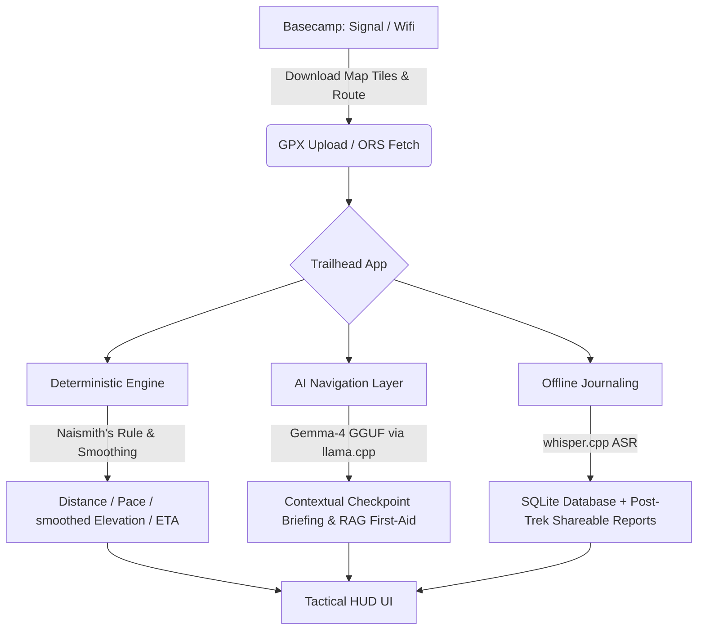

# 🌲 Trailhead — Tactical Trail Computer & Route Planner

[](https://huggingface.co/spaces)
[](https://opensource.org/licenses/MIT)

> **"Plan online at basecamp, trek offline on the trail."**

**Trailhead** is an offline-first, mobile-friendly trail computer and navigation assistant designed for wilderness hiking and backpacking. It parses GPX files, calculates smoothed elevation profiles, generates interactive offline maps, and leverages an in-process Large Language Model (LLM) and Speech-to-Text (ASR) to guide you safely through the backcountry without relying on cellular connection.

---

## 🧭 System Architecture



---

## ✨ Key Features

### 1. Ingest, Planning & POI Fetching (Basecamp Mode)
* **GPX Ingestion:** Directly parse track files, extract metadata, and calculate cumulative distances/elevations.
* **OSM Overpass API Integration:** Pulls nearby Points of Interest (POIs) such as drinking water, alpine huts, campsites, viewpoints, and emergency phones directly from OpenStreetMap.
* **Custom Buffer Filter:** Filters POIs locally using the haversine formula to only retain those within a 150m buffer of the trail.
* **Enhanced GPX Export:** Saves fetched POIs into standard GPX `<extensions>` and `<wpt>` tags to be stored on disk and read offline.

### 2. Tactical HUD, Live GPS & Trek Simulation
* **Live GPS Tracking:** Uses client-side browser Geolocation API (`getCurrentPosition` & `watchPosition`) to plot real-time coordinates. Renders a pulsing blue Google Maps-style location marker with a shaded accuracy circle.
* **Smart Auto-Zoom:** Dynamically scales map zoom levels using Leaflet `fitBounds` to display both the predefined route path and the hiker's live position simultaneously.
* **Unified Trek Controls:** The `▶ START` button serves a dual purpose: if GPS is enabled, it initiates live tracking and locks/centers position updates (throttled at 5 seconds to conserve battery); otherwise, it runs the time-lapse simulation. `⏸ PAUSE` freezes updates, and `🔄 RESET` clears status and restores initial layout.
* **Flicker-Free Client-Side Map:** Renders a native Leaflet canvas directly within the Gradio container. State synchronization from textboxes updates coordinates smoothly in real time without iframe refreshes.
* **Color-Coded Vector Markers:** Custom circle-markers are drawn for POIs (Blue = water, Green = huts, Orange = campsite, Purple = viewpoints, Red = emergency phone) to avoid external asset requests.
* **Playback Simulation Player:** Play, pause, speed slider, and reset state controller updates the hiker's current position along the trail when GPS is disabled.
* **Live HUD Dashboard:** Telemetry tracking route completion percentage, cumulative distance hiked, current altitude, and next-checkpoint ETA.
* **Offline Proximity Alerts:** Audio-visual indicators triggered automatically when the hiker is within 150m of any filtered POI.

### 3. Unified Wilderness Guide & First-Aid AI
* **Unified Chatbot Interface:** Merges the **Wilderness Guide AI** and **Wilderness First-Aid manual** query engine into a single chatbot interface.
* **Emergency Quick-Lookup:** Column layout integrates a sidebar with the offline Emergency Card and a Manual Quick Search accordion for instant access.
* **Robust Local LLM Processing:** Configured with a `120s` timeout threshold to prevent premature mock fallback during heavy local prompt prefilling.
* **Keyword RAG Search:** Local keyword intersection retriever indexes the manual (`first_aid_guide.json`) and guides the local `gemma-2b-it` LLM model to return highly grounded first-aid instructions with manual citations.
* **Proximity Checkpoint Narration:** Delivers terrain updates, safety advice, and target destination briefings as hikers approach landmarks.

### 4. Live GPS Tracking & 1s Updates
* **1-Second Updates:** Configured GPS tracking refresh interval to 1s, enabling high-resolution position updates on the trail.
* **Active Proximity POI Highlights:** Automatically detects and highlights close Points of Interest (POIs) near the hiker's current coordinates in the Active Proximity Alerts panel.

### 5. Offline Voice Journal & Post-Trek Reports
* **ASR Voice Logs:** Dictate logs hands-free in the cold using whisper.cpp tiny. Logs transcribing audio, time, and coordinates are saved directly to SQLite.
* **Post-Trek Storyteller:** Converts journal entries and raw GPS points into an engaging, non-technical first-person narrative (optimized for social media sharing) without listing raw coordinates.

---

## 🚀 Quick Start

### Prerequisites
Make sure you have Python 3.11+ installed.

### Installation

1. **Clone the repository:**
   ```bash
   git clone <your-github-repo-url>
   cd TrailHead
   ```

2. **Create and activate a virtual environment:**
   ```bash
   python -m venv .venv
   # Windows:
   .venv\Scripts\activate
   # macOS/Linux:
   source .venv/bin/activate
   ```

3. **Install dependencies:**
   For local LLM inference on CPU, install `llama-cpp-python` first (using precompiled wheels is recommended for Windows):
   ```bash
   pip install llama-cpp-python --extra-index-url https://abetlen.github.io/llama-cpp-python/whl/cpu
   pip install -r requirements.txt
   ```

4. **Run the Application:**
   ```bash
   python app.py
   ```
   Open `http://localhost:7860` in your web browser.

---

## 📱 Android Installation (Termux)

You can run Trailhead entirely offline on an Android device using Termux. This provides a portable trail computer right in your pocket.

1. **Install Termux** from F-Droid (do not use the Google Play Store version as it's deprecated).
2. **Open Termux and install dependencies:**
   ```bash
   pkg update && pkg upgrade -y
   pkg install python git clang libcrypt libffi -y
   ```
3. **Clone and setup the project:**
   ```bash
   git clone https://github.com/xandie985/TrailHead.git
   cd TrailHead
   python -m venv .venv
   source .venv/bin/activate
   ```
4. **Install Python requirements:**
   ```bash
   pip install -r requirements.txt
   ```
   *(Note: For local LLM processing on Android, compiling `llama-cpp-python` might require additional CMake and build-essential packages. If you just need the map and GPS features, the base requirements are sufficient).*
5. **Run the App:**
   ```bash
   python app.py
   ```
6. Open your mobile browser and navigate to `http://127.0.0.1:7860`.

---

## 🤗 Hugging Face Spaces Setup

This project is fully compatible with Hugging Face Spaces using the Gradio SDK.

### Deploy to Hugging Face Spaces
1. Create a new Space on [Hugging Face](https://huggingface.co/new-space) using the **Gradio** SDK.
2. Push the codebase directly to your Hugging Face Space repository.
3. The GGUF LLM and Whisper ASR models will download automatically upon first request at runtime and cache locally for offline use.

---

## 🛠️ Technical Details & Algorithms

### Elevation Smoothing Filter
Raw GPX files suffer from GPS vertical drift, leading to massive over-reporting of elevation gain. Trailhead resolves this by:
1. Batch-querying missing elevations via the **Open-Meteo API** (when GPX coordinates lack altitude).
2. Applying a **Moving Average window (size 5)** to smooth out high-frequency noise.
3. Using a **threshold delta (default 2.0 meters)**, only summing elevation changes that exceed the threshold:
   $$\Delta E = \sum |e_i - e_{i-1}| \quad \text{for} \quad |e_i - e_{i-1}| \ge 2.0\text{m}$$

### Time Estimation (Naismith's Rule)
We estimate trail times dynamically using the classic Naismith's formula:
$$\text{Time (hours)} = \frac{\text{Distance (km)}}{5.0} + \frac{\text{Elevation Gain (m)}}{600.0}$$
This represents a conservative baseline for an average loaded hiker on established trails.

---

## 📄 License
This project is licensed under the MIT License. See [LICENSE](LICENSE) for details.
