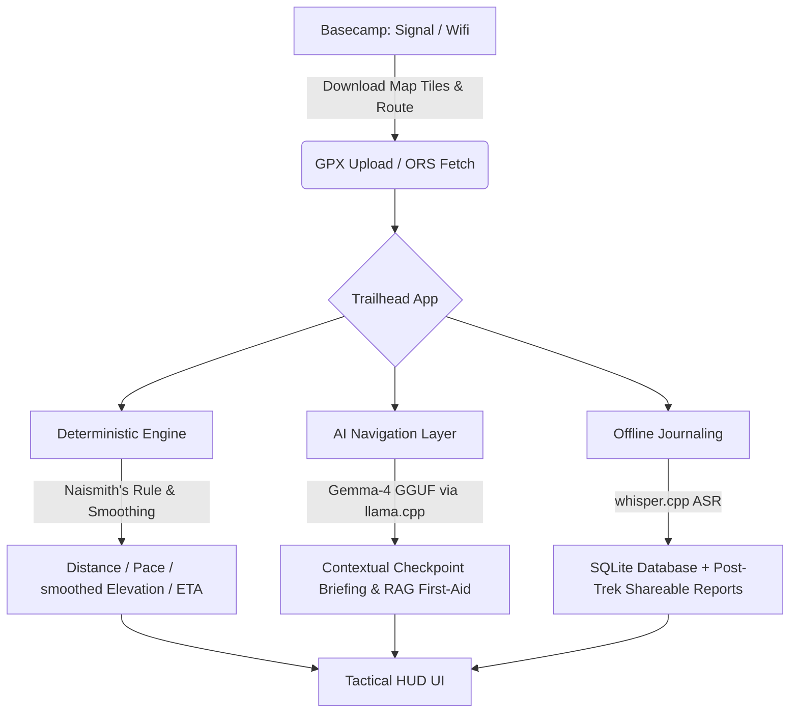

# 🌲 Trailhead — Tactical Trail Computer & Route Planner

[](https://huggingface.co/spaces)
[](./Dockerfile)
[](https://opensource.org/licenses/MIT)

> **"Plan online at basecamp, trek offline on the trail."**

**Trailhead** is an offline-first, mobile-friendly trail computer and navigation assistant designed for wilderness hiking and backpacking. It parses GPX files, calculates smoothed elevation profiles, generates interactive offline maps, and leverages an in-process Large Language Model (LLM) and Speech-to-Text (ASR) to guide you safely through the backcountry without relying on cellular connection.

---

## 🧭 System Architecture



---

## ✨ Key Features

### 1. Ingest & Planning (Basecamp Mode)
* **GPX Upload:** Directly upload any standard GPX route containing track points or waypoints.
* **OpenRouteService (ORS) Routing:** Generate custom route segments between coordinates using the OSM-based ORS API (requires API key, planning phase only).

### 2. Tactical HUD & Route Metrics
* **Elevation Profile Smoothing:** Applies a moving-average window and noise threshold to eliminate GPX vertical jitter and provide realistic elevation gain/loss sums.
* **Naismith's Rule Estimator:** Calculates estimated trekking time assuming a 5 km/h base speed plus 1 hour per 600m of ascent, helping you plan realistic daily splits.
* **Interactive Map:** Built using `folium`, mapping out the route, checkpoints, and waypoints securely inside a sandboxed iframe.

### 3. Contextual Wilderness Guide AI
* **In-Process LLM:** Powered by `google_gemma-4-E2B-it-GGUF` running locally on your device or server CPU via `llama-cpp-python`.
* **Proximity Checkpoint Narration:** Provides real-time terrain updates, safety advice, and target destination briefings as you approach waypoints.
* **First-Aid RAG Field Guide:** Retreives localized wilderness first-aid procedures and references corresponding guide sections under extreme constraints.
* **Rule-Based Risk Advisory:** Analyzes remaining daylight, current altitude (AMS detection), and weather to prompt warnings (e.g. recommending alternative campsites if pace degrades).

### 4. Offline Voice Journal & Post-Trek Reports
* **ASR Voice Logs:** Dictate logs hands-free in the cold using `pywhispercpp` (whisper.cpp tiny). Logs transcribing audio, time, and coordinates are saved directly to SQLite.
* **Post-Trek Storyteller:** Converts your journal entries and raw GPS points into an AI-narrated story artifact.

---

## 🚀 Quick Start

### Prerequisites
Make sure you have Python 3.11+ installed.

### Installation

1. **Clone the repository:**
   ```bash
   git clone <your-github-repo-url>
   cd TrailHead
   ```

2. **Create and activate a virtual environment:**
   ```bash
   python -m venv .venv
   # Windows:
   .venv\Scripts\activate
   # macOS/Linux:
   source .venv/bin/activate
   ```

3. **Install dependencies:**
   For local LLM inference on CPU, install `llama-cpp-python` first (using precompiled wheels is recommended for Windows):
   ```bash
   pip install llama-cpp-python --extra-index-url https://abetlen.github.io/llama-cpp-python/whl/cpu
   pip install -r requirements.txt
   ```

4. **Run the Application:**
   ```bash
   python app.py
   ```
   Open `http://localhost:7860` in your web browser.

---

## 🐳 Docker Setup & Hugging Face Spaces

This project is fully ready to be deployed as a Docker container or hosted directly as a Hugging Face Space.

### Run locally with Docker
Build and run the Docker container:
```bash
docker build -t trailhead-computer .
docker run -p 7860:7860 trailhead-computer
```

### Deploy to Hugging Face Spaces
1. Create a new Space on [Hugging Face](https://huggingface.co/new-space) using the **Docker** SDK.
2. Select the **Blank** template or copy the `Dockerfile` directly.
3. Push the codebase to your Hugging Face Space repository.
4. The container automatically downloads the `google_gemma-4-E2B-it-Q4_K_M.gguf` model during build time, ensuring the Space starts up instantly without any downloading delays on first launch.

---

## 🛠️ Technical Details & Algorithms

### Elevation Smoothing Filter
Raw GPX files suffer from GPS vertical drift, leading to massive over-reporting of elevation gain. Trailhead resolves this by:
1. Batch-querying missing elevations via the **Open-Meteo API** (when GPX coordinates lack altitude).
2. Applying a **Moving Average window (size 5)** to smooth out high-frequency noise.
3. Using a **threshold delta (default 2.0 meters)**, only summing elevation changes that exceed the threshold:
   $$\Delta E = \sum |e_i - e_{i-1}| \quad \text{for} \quad |e_i - e_{i-1}| \ge 2.0\text{m}$$

### Time Estimation (Naismith's Rule)
We estimate trail times dynamically using the classic Naismith's formula:
$$\text{Time (hours)} = \frac{\text{Distance (km)}}{5.0} + \frac{\text{Elevation Gain (m)}}{600.0}$$
This represents a conservative baseline for an average loaded hiker on established trails.

---

## 📄 License
This project is licensed under the MIT License. See [LICENSE](LICENSE) for details.
