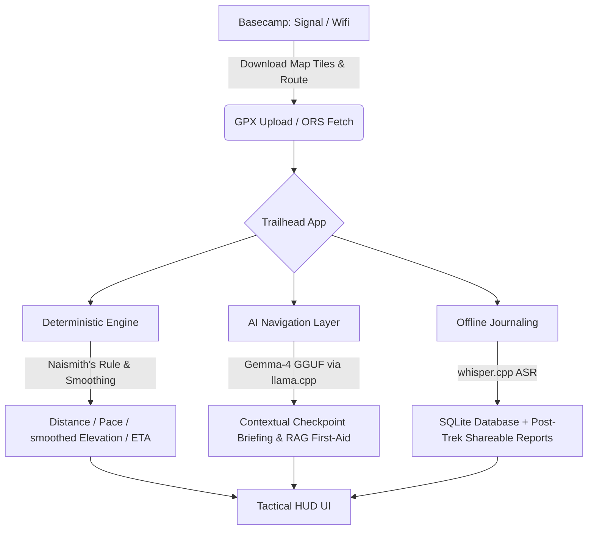

# 🌲 Trailhead: Tactical Trail Computer & Offline-First Navigation Assistant

**Track Alignment:** Backyard AI  
**Target Special Awards:** Tiny Titan (≤4B), Best Agent, Off-the-Grid, Field Notes, Off-Brand  
**Hugging Face Space:** [sxandie/trailhead](https://huggingface.co/spaces/sxandie/trailhead)  
**Author/Team Lead:** @sxandie  

---

## 📌 Executive Summary

For wilderness backpackers, network connectivity drops out precisely when it's needed most. Standard mapping apps fail without pre-downloaded tiles, and powerful AI guidance for emergencies or route planning vanishes without a cloud connection.

**Trailhead** is an offline-first, mobile-friendly tactical trail computer designed to solve this gap. By operating entirely on consumer-grade mobile devices (via Termux on Android) or resource-constrained shared CPUs (via Hugging Face Spaces), Trailhead parses GPX routes, calculates smoothed elevation, renders live GPS maps, and utilizes a local in-process LLM and Speech-to-Text (ASR) to act as a backcountry guide—all **with zero external cloud API dependencies.**

---

## 🎒 Target Persona & The Problem Statement

Our "Backyard AI" persona is an avid backcountry hiker embarking on multi-day treks far beyond cellular reach. Their challenges are threefold:
1. **Unreliable GPX Data:** Raw GPX files often have vertical drift, vastly inflating elevation gain estimates and throwing off trek timing.
2. **Lack of Offline Context:** Hikers need to know their ETA, remaining daylight, and upcoming water sources, but standard apps lack intelligent, dynamic pacing (Naismith's Rule) combined with offline POI data.
3. **Emergency & Safety Information:** In the event of an injury (e.g., a sprained ankle or altitude sickness), hikers need immediate access to grounded wilderness first-aid protocols, hands-free via voice, without waiting for a 3G handshake.

### The Verification Plan (Off the Grid)
To prove the offline-first claim, the application was designed to run in **Airplane Mode**:
- **Ingestion & Smoothing:** A GPX file is parsed locally. Elevation is smoothed using a moving average window to provide accurate ascent data and calculate Naismith pace estimates.
- **Voice Journaling:** Speak: *"I'm at kilometer 5, stopping for water"* and have whisper.cpp transcribe and log it to a local SQLite database, geotagged.
- **First-Aid RAG:** Ask for help with a sprain and receive grounded advice from the local `first_aid_guide.json` via the offline LLM.

---

## 🏗️ Technical Architecture & Stack Deep-Dive

Trailhead employs a dual deployment architecture:
- **Hugging Face Space (CPU Tier):** `llama-cpp-python` loads the Gemma-4 GGUF in-process on Space compute.
- **Android (Termux - Fully Offline):** Gradio runs natively in Termux with local LLM capabilities.

### 1. The Local LLM Engine
- **Model Choice:** `google_gemma-4-E2B-it-GGUF` (~2.3B active parameters).
- **Quantization:** `Q4_K_M GGUF`. It provides a highly efficient memory profile that runs smoothly on older laptops or mobile handsets.
- **Runtime:** `llama-cpp-python` bindings compile and run native GGML matrix multiplication directly inside the Python process, with a mutex lock to serialize generation passes.

### 2. Live GPS & Offline Proximity
- **Live GPS Tracking:** Uses client-side browser Geolocation APIs (`watchPosition`) to plot real-time coordinates. Auto-zooms to keep both the trail and hiker in view.
- **Proximity Alerts:** As hikers approach pre-downloaded Points of Interest (POIs) like water sources or campsites, an offline audio-visual alert triggers. 

### 3. Voice Input via On-Device ASR (Whisper.cpp)
Typing with cold hands or hiking gloves is impractical. Trailhead incorporates voice functionality:
- **Whisper.cpp Engine:** Utilizes `pywhispercpp` with a local `tiny` model.
- **Audio Transcoding:** Native miniaudio/wave conversion processes audio directly into 16kHz mono WAV format locally, ensuring voice journals and queries work seamlessly off-grid.

### 4. Grounded Wilderness First-Aid (Local RAG)
To prevent the 2B model from hallucinating medical advice in life-or-death scenarios, Trailhead uses a local keyword retrieval system over a bundled Wilderness First-Aid manual (`first_aid_guide.json`). When a user queries about an injury, the app extracts the exact protocol from the guide and injects it into the prompt, citing the specific manual section.

---

## 🌟 Key Product Features

### 1. 🏔️ Deterministic Trek Analytics
Trailhead parses GPX files, corrects noisy elevation data using a moving average and a 2.0-meter minimum threshold, and accurately predicts trek times using Naismith's Rule. 

### 2. 🗺️ Tactical HUD & Interactive Mapping
The frontend is a completely custom, mobile-optimized Gradio interface featuring a native Leaflet canvas. It supports live GPS tracking with high-frequency 1-second refresh intervals, simulated trek playback, active proximity alert updates, and highlights POI markers near the hiker's current position on the map without needing external map tile fetches on the trail.

### 3. 💬 Unified Wilderness AI Chatbot
Combines the Wilderness Guide AI and the Wilderness First-Aid RAG manuals into a single chatbot interface tab. Features a side-by-side split screen with an Emergency Card and Quick Search Manual sidebar alongside the main chatbot window.

### 4. 🎙️ Geotagged Voice Journal & Storyteller
Hikers can log voice entries while hiking. The application transcribes the audio, stamps it with current GPS coordinates and altitude, and stores it in an SQLite database. Post-trek, the LLM compiles these logs, stats, and POI encounters into an engaging, non-technical, shareable social media expedition report.

---

## 🎨 Design Aesthetics & Visual Polish
The application UI features a tactical, outdoor-readable theme:
- High contrast layouts optimized for glaring sunlight on mobile screens.
- Unified trek controls (Start/Pause/Reset) that elegantly switch between live GPS tracking and simulated playback.
- A "HUD" dashboard displaying real-time telemetry: percentage complete, pace, current altitude, and next-checkpoint ETA.

---

## 👥 Hackathon Team (Hugging Face Usernames)
- **@sxandie** (Lead Developer)

---

## 🔮 Future Outlook
Trailhead proves that complex geospatial parsing, RAG-based safety protocols, and LLM guidance don't require the cloud. By packaging a ~2.3B parameter model and whisper.cpp ASR into an offline Gradio application, we empower hikers to venture off the grid with the intelligence of a dedicated wilderness guide right in their pockets.
